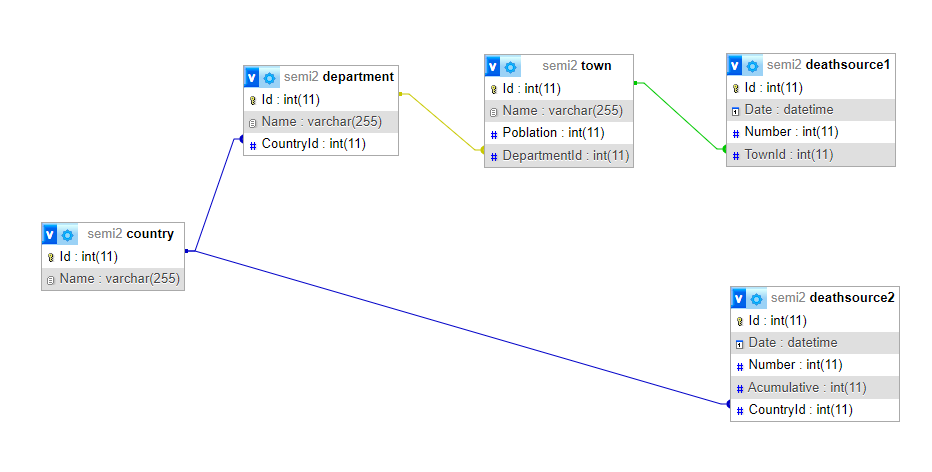

## Documentación | Proyecto 1 

### _Descripción_

Se ha realizado un estudio sobre los datos recopilados por el Ministerio de Salud durante la pandemia del Covid-19. Estos datos fueron obtenidos por medio de tabulación de estos durante todos los días del año 2020. 
Como científico de datos, se realizaron las tareas asignadas de recolección y limpieza de los datos, para posteriormente guardarlos en una base de datos. Por medio de la recolección se buscó obtener todos los datos de 2 fuentes principales, una como un archivo local y otra de un url proporcionado.

### _Proceso_
#### Parámetros

Para una correcta ejecución del programa, se debe de proporcionar un parámetro para el tamaño del `batch` de la siguiente manera:

    python main.py 'tamaño del batch'

#### Extracción

`load_towns(file)`

Propósito: Esta función está diseñada para cargar datos de muertes especificadas por municipio desde un archivo CSV a un DataFrame de la librería Pandas.

Parámetros:
- file: La ruta del archivo CSV que contiene los datos de los pueblos.

Comportamiento: 
- Intenta leer el archivo CSV especificado por el parámetro file en un DataFrame de Pandas (df).
- Convierte los nombres de las columnas a minúsculas para mantener consistencia.
- Imprime el DataFrame cargado (df) si el archivo se lee con éxito.
- Imprime un mensaje de éxito si los datos se cargan correctamente.
- Imprime un mensaje de error si ocurre alguna excepción durante el proceso de carga.

Retorna:
Retorna el DataFrame de Pandas cargado (df) si tiene éxito; de lo contrario, retorna None.

    def load_towns(file):
        df = None
        try:
            df = pd.read_csv(file)
            df.columns = df.columns.str.lower()
            print(df)
        
            print('\n')
            print('Information: All town data loaded')
            print('\n')
        except Exception as e:
            print(f'Error: Failed to load towns data: {str(e)}')
        
        return df

`load_countries(url)`

Propósito: Esta función está diseñada para cargar datos de países desde un archivo CSV accesible mediante una URL a un DataFrame de la librería Pandas.

Parámetros: url: La URL que apunta al archivo CSV que contiene los datos de los países.

Comportamiento:
- Envía una solicitud HTTP a la URL especificada para obtener el contenido CSV.
- Si la solicitud tiene éxito (código de estado 200), se procesa el contenido CSV y se crea un DataFrame de Pandas (df).
- Convierte los nombres de las columnas a minúsculas para mantener consistencia.
- Imprime el DataFrame cargado (df) si los datos se cargan con éxito.
- Imprime un mensaje de éxito si los datos se cargan correctamente.
- Imprime un mensaje de error si la solicitud HTTP falla o si ocurre alguna excepción durante el proceso de carga.

Retorna: Retorna el DataFrame de Pandas cargado (df) si tiene éxito; de lo contrario, retorna None.
Estas funciones siguen una estructura similar, utilizando un bloque try-except para manejar posibles errores durante el proceso de carga de datos. Las funciones imprimen mensajes informativos para indicar el éxito o el fracaso de la operación de carga.

    def load_countries(url):
        df = None
        try:
            response = requests.get(url)
            if response.status_code == 200:
                csv_content = response.text
                csv = csv_content.replace('', '')
                df = pd.read_csv(StringIO(csv))
                df.columns = df.columns.str.lower()
                print(df)

                print('\n')
                print('Information: All countries data loaded')
                print('\n')
            else:
                print(f"Error: Failed to fetch data. Status code: {response.status_code}")
        except Exception as e:
            print(f'Error: Failed to load countries data: {str(e)}')

        return df

`clean_towns(df)`

Propósito: Esta función está diseñada para realizar una serie de operaciones de limpieza en un DataFrame de municipios.

Parámetros:
- df: DataFrame de Pandas que contiene datos de municipios.

Comportamiento:
- Elimina las filas duplicadas basadas en las columnas 'departamento' y 'municipio'.
- Elimina columnas innecesarias ('codigo_departamento' y 'codigo_municipio').
- Conserva solo las columnas relacionadas con el año 2020, 'departamento', 'municipio' y 'poblacion'.
- Reemplaza los valores nulos y escribe los valores por defecto en columnas no determinantes.
- Elimina las filas con valores nulos en las columnas determinantes ('departamento' y 'municipio').
- Elimina las filas con valores incorrectos en las columnas determinantes ('departamento' y 'municipio').

Retorna: Retorna un nuevo DataFrame de Pandas (df_processed) después de aplicar las operaciones de limpieza.

    def clean_towns(df):
        df_processed = df
        try:
            # Delete duplicated rows
            df_processed = df.drop_duplicates(subset=['departamento', 'municipio'])
            print(df_processed)

            # Delete unnecessary columns
            df_processed = df_processed.drop(['codigo_departamento', 'codigo_municipio'], axis=1)
            print(df_processed)

            # Only 2020 data
            df_processed = df_processed.filter(regex=r'^(.*2020.*)$|^(departamento|municipio|poblacion)$', axis=1)
            print(df_processed)

            # Replace null values and write invalid values to non determining columns
            modify = [col for col in df_processed.columns if col not in ['departamento', 'municipio']]
            for col in modify:
                df_processed[col] = pd.to_numeric(df_processed[col], errors='coerce').fillna(0).astype('Int64')
                df_processed[col] = df_processed[col].apply(lambda x: max(x, 0))
            print(df_processed)

            # Delete rows with null values to determining columns
            df_processed = df_processed.dropna(subset=['departamento', 'municipio'])
            print(df_processed)

            # Clear to only right values on determining columns
            credibilidad_mask = df_processed[['departamento','municipio']].map(lambda x: any(char.isdigit() for char in str(x)))
            df_processed = df_processed[~credibilidad_mask.any(axis=1)]
            print(df_processed)

            print('\n')
            print('Information: All towns data cleaned')
            print('\n')
        except Exception as e:
            print(f'Error: Failed to clean towns data: {str(e)}')
        
        return df_processed

`clean_countries(df, country)`

Propósito: Esta función está diseñada para realizar una serie de operaciones de limpieza en un DataFrame de países, enfocándose en datos específicos de Guatemala.

Parámetros:
- df: DataFrame de Pandas que contiene datos de países.
- country: País al que se restringirán los datos (en este caso, Guatemala).

Comportamiento:
- Filtra el DataFrame para incluir solo datos relacionados con el país especificado (Guatemala).
- Elimina las filas duplicadas basadas en la columna 'date_reported'.
- Elimina columnas innecesarias ('country_code', 'who_region', 'new_cases' y 'cumulative_cases').
- Reemplaza los valores nulos y escribe los valores por defecto en columnas no determinantes.
- Elimina las filas con valores nulos en las columnas determinantes ('date_reported' y 'country').
- Elimina las filas con valores no válidos en las columnas determinantes ('date_reported' y 'country').
- Convierte la columna 'date_reported' al tipo de dato datetime.
- Filtra los datos para incluir solo aquellos del año 2020.

Retorna: Retorna un nuevo DataFrame de Pandas (df_processed) después de aplicar las operaciones de limpieza.

    def clean_countries(df, country):
        df_processed = df
        try:
            # Only Guatemalan data
            df_processed = df[df['country'].str.lower() == country.lower()]
            print(df_processed)

            # Delete duplicated rows
            df_processed = df_processed.drop_duplicates(subset=['date_reported'])
            print(df_processed)

            # Delete unnecessary columns
            df_processed = df_processed.drop(['country_code', 'who_region', 'new_cases', 'cumulative_cases'], axis=1)
            print(df_processed)

            # Replace null values and write invalid values to non determining columns
            modify = [col for col in df_processed.columns if col not in ['date_reported', 'country']]
            for col in modify:
                df_processed[col] = pd.to_numeric(df_processed[col], errors='coerce').fillna(0).astype('Int64')
                df_processed[col] = df_processed[col].apply(lambda x: max(x, 0))
            print(df_processed)

            # Replace null values and write invalid values to determining columns
            df_processed = df_processed.dropna(subset=['date_reported', 'country'])
            for col in ['date_reported', 'country']:
                df_processed = df_processed[df_processed[col].apply(lambda x: isinstance(x, str))]
            print(df_processed)

            # Convert date_reported to datetime type
            df_processed['date_reported'] = pd.to_datetime(df_processed['date_reported'], errors='coerce')
            df_processed = df_processed.dropna(subset=['date_reported'])
            print(df_processed)

            # Only 2020 data
            df_processed = df_processed[df_processed['date_reported'].dt.year == 2020]
            print(df_processed)

            print('\n')
            print('Information: All countries data cleaned')
            print('\n')
        except Exception as e:
            print(f'Error: Failed to clean countries data: {str(e)}')
        
        return df_processed

#### Transformación

`transform_data(towns, countries)`

Propósito: Esta función está diseñada para realizar transformaciones en los datos de municipios y países, para al final fusionarlos en un único DataFrame.

Parámetros:
- towns: DataFrame de Pandas que contiene datos de municipios.
- countries: DataFrame de Pandas que contiene datos de países.

Comportamiento:
- Utiliza la función pd.melt para transformar el DataFrame de municipios (towns) de un formato ancho a un formato largo, manteniendo las columnas 'departamento', 'municipio', 'poblacion' y creando nuevas columnas 'Fecha' y 'MuertesFuente1'.
- Convierte la columna 'Fecha' al tipo de dato datetime.
- Fusiona los DataFrames de municipios y países (countries) utilizando la columna de fecha ('Fecha' y 'date_reported', respectivamente) mediante la función pd.merge.
- Renombra las columnas 'new_deaths' y 'cumulative_deaths' a 'MuertesFuente2' y 'MuertesAcumulativas', respectivamente.
- Imprime el DataFrame resultante (df_final).

Retorna: Retorna un nuevo DataFrame de Pandas (df_final) que resulta de la fusión y transformación de los datos de municipios y países.

    def transform_data(towns, countries):
        df_final = None
        try:
            # Transform towns dataframe
            df_towns = pd.melt(towns, id_vars=['departamento', 'municipio', 'poblacion'], var_name='Fecha', value_name='MuertesFuente1')

            # Transform 'Fecha' column to datetime
            df_towns['Fecha'] = pd.to_datetime(df_towns['Fecha'], errors='coerce')

            # Merge both dataframs by date column
            df_final = pd.merge(df_towns, countries[['date_reported', 'new_deaths', 'cumulative_deaths']], left_on='Fecha', right_on='date_reported', how='left')

            # Format column
            df_final = df_final.rename(columns={'new_deaths': 'MuertesFuente2', 'cumulative_deaths': 'MuertesAcumulativas'})
            print(df_final)

            print('\n')
            print('Information: All countries data cleaned')
            print('\n')
        except Exception as e:
            print(f'Error: Failed to clean countries data: {str(e)}')
            
        return df_final

#### Carga

`create_blocks(data, batch_size)`

Propósito: Crea bloques de datos para su posterior inserción en la base de datos.

Parámetros:
- data: DataFrame de Pandas que contiene los datos a ser insertados.
- batch_size: Tamaño del bloque (número de filas por bloque).

Comportamiento:
- Llama a funciones específicas para ejecutar acciones relacionadas con el país y crear consultas para departamentos, municipios y fuentes de datos.
- Imprime información sobre la cantidad de bloques a crear.

Retorna: Una lista de bloques, donde cada bloque contiene consultas para departamentos, municipios y fuentes de datos.

    def create_blocks(data, batch_size):
        blocks = list(batched(data, batch_size))
        final_blocks = []
        execute_country()
        print('\n')
        print('Information: Creating',len(blocks),'blocks...')
        print('\n')
        for block in blocks:
            queries = {}
            queries.update({'departments': create_departments_query(block)})
            queries.update({'towns': create_towns_query(block)})
            queries.update({'deathsource1': create_deathsource1_query(block)})
            queries.update({'deathsource2': create_deathsource2_query(block)})
            final_blocks.append(queries)

        return final_blocks

`create_departments_query(data)`

Propósito: Crea una consulta SQL para insertar departamentos en la base de datos.

Parámetros:
- data: Bloque de datos para el cual se crea la consulta.

Comportamiento:
- Crea una consulta INSERT INTO para departamentos evitando duplicados.

Retorna: La consulta o una cadena vacía si no hay datos nuevos.

    def create_departments_query(data):
        departments_local = []
        query = 'INSERT INTO department (Name, CountryId) VALUES\n'
        for i, row in enumerate(data):
            if any(department['Name'] == row.departamento for department in departments): continue
            
            departments.append({'Name': row.departamento})
            departments_local.append({'Name': row.departamento})
            query += f'(\'{row.departamento}\', (SELECT Id FROM country WHERE Name = \'Guatemala\')),\n'
        if len(departments_local) == 0: return ''
        else: return query[:-2] + ';\n'

`create_towns_query(data)`

Propósito: Crea una consulta SQL para insertar municipios en la base de datos.

Parámetros:
- data: Bloque de datos para el cual se crea la consulta.

Comportamiento:
- Crea una consulta INSERT INTO para municipios evitando duplicados.

Retorna: La consulta o una cadena vacía si no hay datos nuevos.

    def create_towns_query(data):
        towns_local = []
        query = 'INSERT INTO town (Name, Poblation, DepartmentId) VALUES\n'
        for i, row in enumerate(data):
            if any(town['Department'] == row.departamento and town['Town'] == row.municipio for town in towns): continue

            towns.append({'Department': row.departamento, 'Town': row.municipio})
            towns_local.append({'Department': row.departamento, 'Town': row.municipio})
            query += f'(\'{row.municipio}\', {row.poblacion}, (SELECT Id FROM department WHERE Name = \'{row.departamento}\')),\n'
        if len(towns_local) == 0: return ''
        else: return query[:-2] + ';\n'

`create_deathsource1_query(data)`

Propósito: Crea una consulta SQL para insertar datos en la tabla DeathSource1.

Parámetros:
- data: Bloque de datos para el cual se crea la consulta.

Comportamiento:
- Crea una consulta INSERT INTO para datos en DeathSource1.

Retorna: La respectiva consulta.

    def create_deathsource1_query(data):
        query = 'INSERT INTO deathsource1 (Date, Number, TownId) VALUES\n'
        for i, row in enumerate(data):
            query += f'(\'{row.Fecha}\', {row.MuertesFuente1}, (SELECT Id FROM town WHERE Name = \'{row.municipio}\' AND DepartmentId = (SELECT Id FROM department WHERE Name = \'{row.departamento}\'))),\n'

        return query[:-2] + ';\n'

`create_deathsource2_query(data)`

Propósito: Crea una consulta SQL para insertar datos en la tabla DeathSource2.

Parámetros:
- data: Bloque de datos para el cual se crea la consulta.

Comportamiento:
- Crea una consulta INSERT INTO para datos en DeathSource2 evitando duplicados.

Retorna: La consulta o una cadena vacía si no hay datos nuevos.

    def create_deathsource2_query(data):
        deaths_local = []
        query = 'INSERT INTO deathsource2 (Date, Number, Acumulative, CountryId) VALUES\n'
        for i, row in enumerate(data):
            if any(death['date_reported'] == row.date_reported for death in deaths): continue

            deaths.append({'date_reported': row.date_reported})
            deaths_local.append({'date_reported': row.date_reported})
            query += f'(\'{row.date_reported}\', {row.MuertesFuente2}, {row.MuertesAcumulativas}, (SELECT Id FROM country WHERE Name = \'Guatemala\')),\n'
        if len(deaths_local) == 0: return ''
        else: return query[:-2] + ';\n'

`insert_data(blocks)`

Propósito: Ejecuta las consultas SQL para insertar datos en la base de datos.

Parámetros:
- blocks: Lista de bloques, donde cada bloque contiene consultas para departamentos, municipios y fuentes de datos.

Comportamiento:
- Llama a funciones específicas para ejecutar consultas y realizar commit.
- Imprime información sobre bloques insertados con éxito y bloques con errores.
- Maneja posibles errores de MySQL y realiza commit final antes de cerrar la conexión.

Retorna: Nada.

    def insert_data(blocks):
        execute_queries(blocks)
        execute_recover()

`execute_queries(queries) y execute_recover()`

Propósito: Ejecutar consultas SQL para insertar bloques de datos.

Parámetros:
- queries: Lista de bloques, donde cada bloque contiene consultas SQL para departamentos, municipios y fuentes de datos.

Comportamiento:
- Llama a la función execute para cada consulta en la lista de bloques.
- Imprime información sobre bloques insertados con éxito y bloques con errores.

Retorna: Nada.

    def execute_queries(queries):
        block_number = 1
        print('\n')
        print('Information: Inserting blocks...')
        print('\n')
        for query in queries:
            execute(query, block_number)
            block_number += 1
        print("\n")
        print(f"Information: Inserted blocks: {inserted}", f" blocks not inserted: {failed}")
        print("\n")

`execute(query, block_number) y recover(query, block_number)`

Propósito: Ejecutar una consulta SQL para insertar un bloque de datos.

Parámetros:
- query: Diccionario que contiene consultas SQL para departamentos, municipios y fuentes de datos.
- block_number: Número de bloque.

Comportamiento:
- Ejecuta cada consulta SQL y realiza commit después de todas las inserciones exitosas.
- Maneja errores, imprime mensajes informativos y realiza rollback si la ejecución falla.

Retorna: Nada.

    def execute(query, block_number):
        try:
            global inserted
            cursor = connection.cursor()
            if query['departments'] != '': cursor.execute(query['departments'])
            if query['towns'] != '': cursor.execute(query['towns'])
            if query['deathsource1'] != '': cursor.execute(query['deathsource1'])
            if query['deathsource2'] != '': cursor.execute(query['deathsource2'])
            # print('Information: Block number',block_number,'inserted')
            inserted += 1
            connection.commit()
        except Exception as e:
            global failed
            failed += 1
            blocks_failed.append(query)
            print('Information: Block number',block_number,' failed to insert')
            print(f"Error: Failed to execute query: {e}")
            connection.rollback()
        else:
            cursor.close()

`execute_country()`

Propósito: Insertar el país 'Guatemala' en la tabla country.

Comportamiento:
- Ejecuta una consulta SQL para insertar 'Guatemala' en la tabla country.
- Maneja errores, imprime mensajes informativos y realiza rollback si la ejecución falla.

Retorna: Nada.

    def execute_country():
        try:
            cursor = connection.cursor()
            cursor.execute('INSERT INTO country (Name) VALUES (\'Guatemala\')')
            connection.commit()
        except Exception as e:
            print(f"Error: Failed to execute query: {e}")
            connection.rollback()
        else:
            cursor.close()

### _Modelo relacional_

Para el desarrollo de la carga de datos, se procedió a utilizar el modelo presentado a continuación, donde se tiene como country tabla principal, y las demás tablas se desarrollan para almacenar los datos de las dos fuentes proporcionadas, donde la primera requiere de almacenamiento de localizaciones más específicas como departamento y municipio, mientras que la segunda fuente no poseía esa información, por lo que únicamente se tiene la tabla deathsource2 que almacena todos los datos proporcionados, como fecha, número de muertes, número de muertes acumulativas, y en su contraparte de la primera fuente llamada deathsource1, en la cual se tienen datos similares únicamente cambia a una relación con su respectivo municipio, lo que no pasa con deathsource2 que es directamente con la tabla country.

###### _2023 - Laboratorio de Seminario de Sistemas 2_

---
